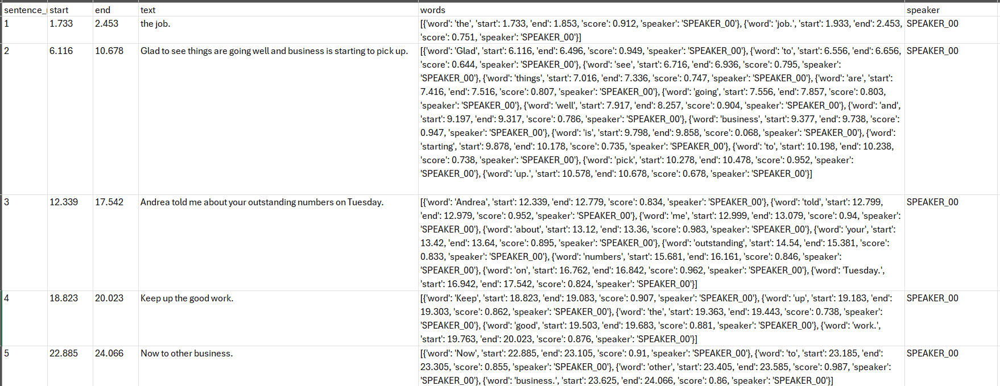

# NLP_Research_Pipelines (In Progress)
1. WhisperXTranscription4Researchers: This notebook leverages advanced transcription and diarization capabilities provided by the Whisper, WhisperX, and pyannote libraries. By using GPU acceleration, it processes audio data efficiently, performing alignment and diarization to produce structured outputs that are saved in CSV format for further analysis. This will batch transcribe all marked audio files found in a folder or subfolder of the path folder. This will also output the resulting csv and txt files to the folder where the audio files were found. The process will also anonymize specific names, diarize voices, and set up the files that can be used for the rest of the NLP pipeline. (Working)

2. Corpus Comparison Tool:(Working)
3. NLTK NLP Text Analytics:(Working)
4. SpaCy + BERTopic Topic Modeling Pipeline: (In Progress)
5. Gensim Pipeline: (In Progress)